# ai-startup-website

##This is the creation of a website for an AI startup company that involve collaborative work with Tom & Jerry. The website includes various sections like Home, About us, Services, and Contact Information.

Creation of Remote Repository On GitHub

Copy Repo For Cloning

Cloning Repo Locally
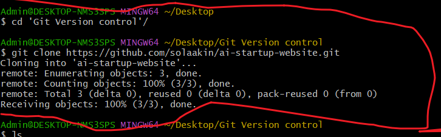

Creating An Empty Index.html File
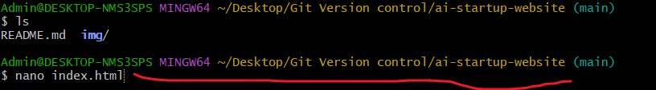

Updating Index.html File
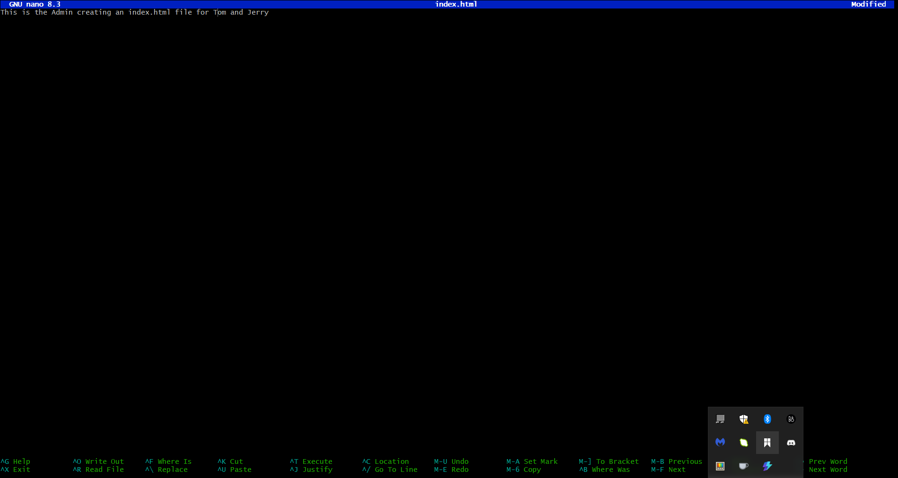

Stanging, Committing And Pushing Project to Remote Repo For Collaboration

Collaborators Invitations
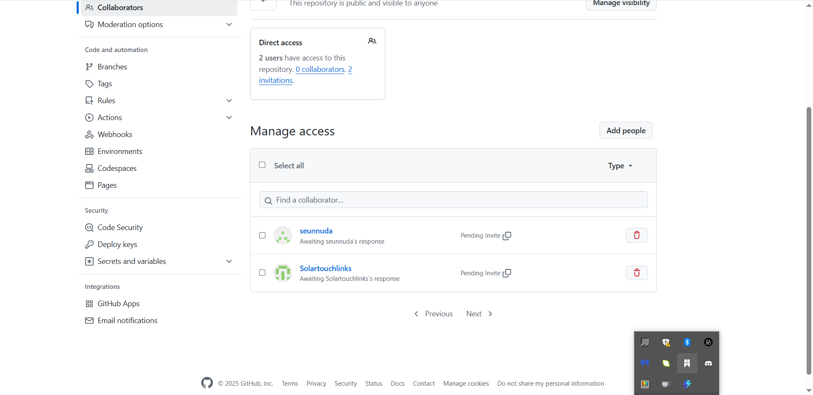

Tom Accepting And Copy Repo For Clone
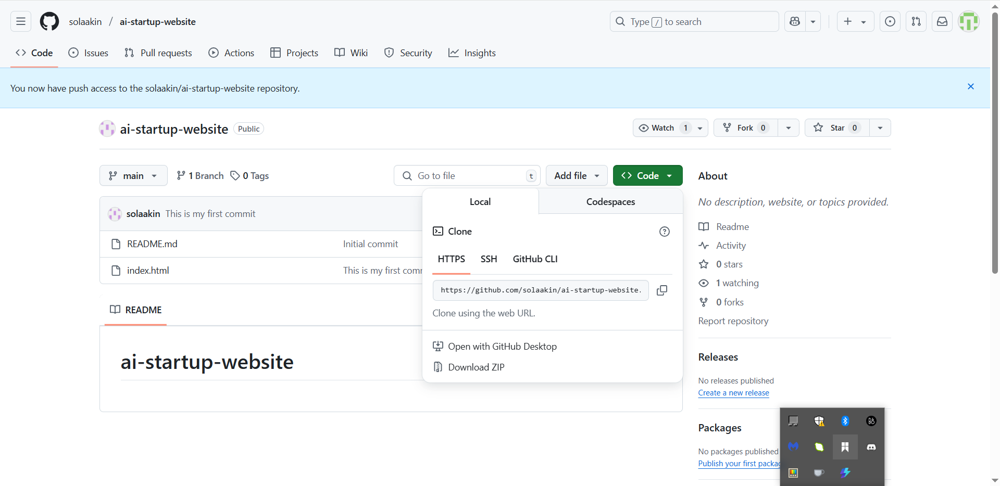

Tom Clone Repo Locally

Tom Creat Branch Update Navigation & Callup Index.html File

Tom Update Navigation In Index.html File
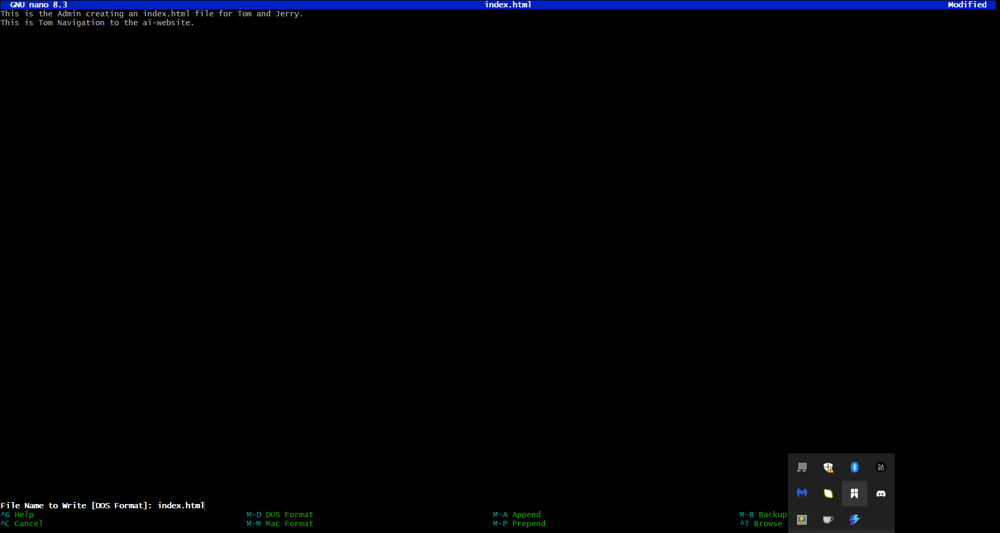

Tom Stage Index.html Commit Update Navigation & Push Origin Main
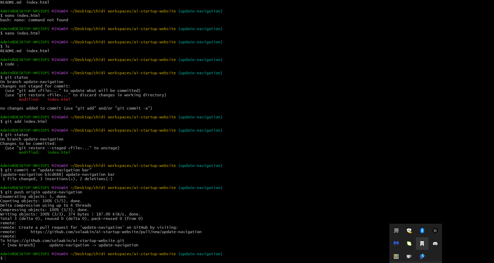

Solaakin Create Pull Request And Merge Pull Request Toms Work
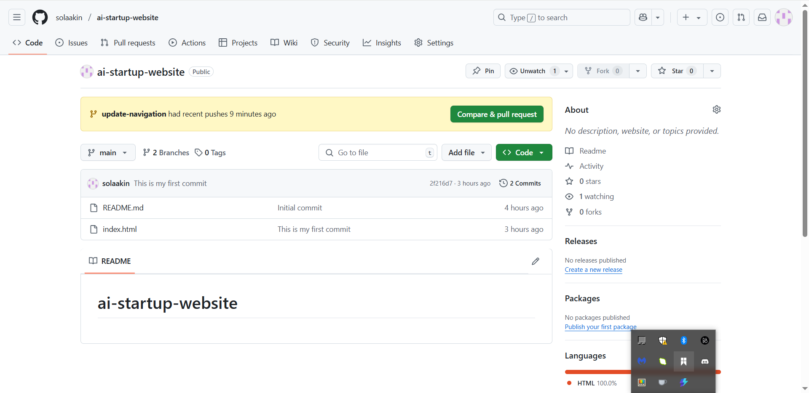
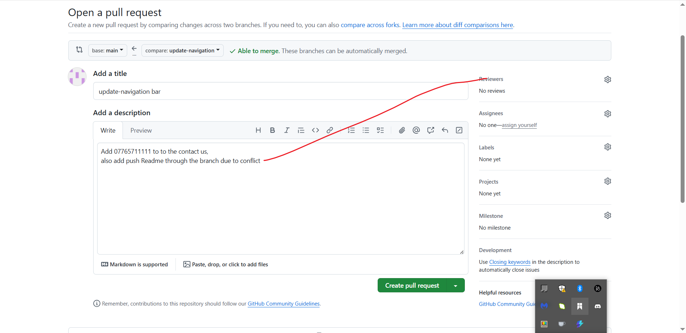
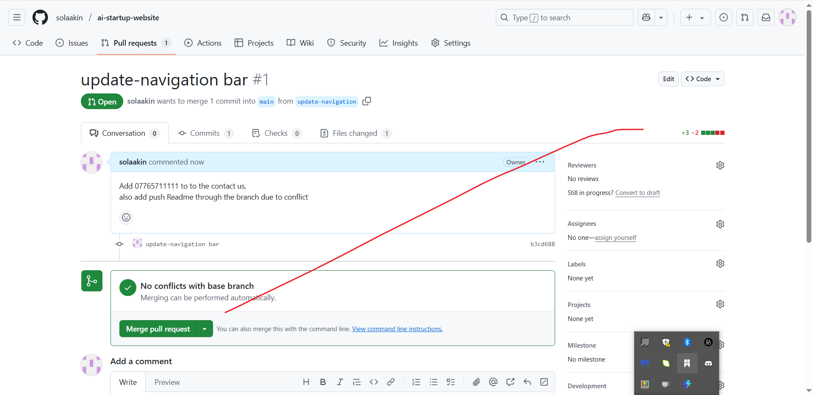
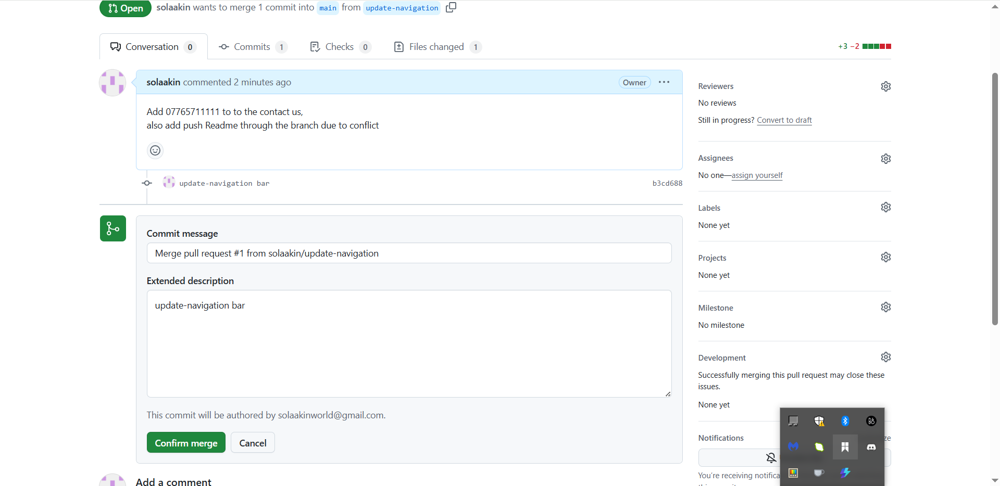

SolaAkin Merged Toms Update Navigation Branch
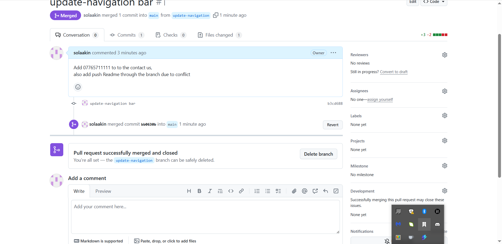

Jerry Accepting Collaboration Invite
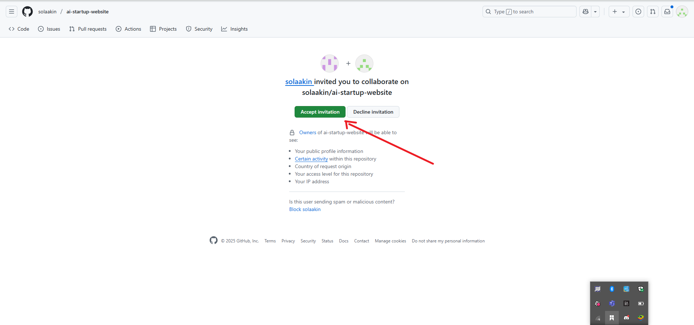

Jerry Copy & Clone Repo
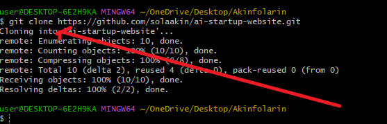

Jerry Create Branch Add-Contact-Info
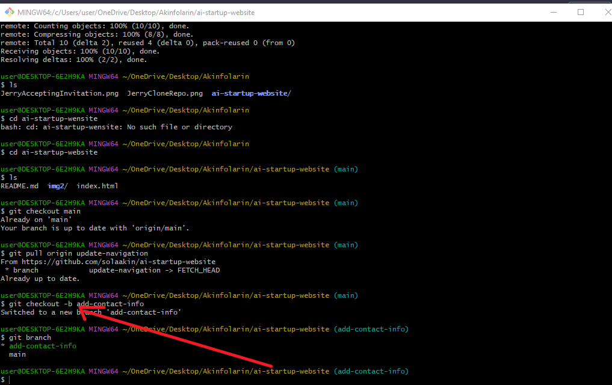

Jerry Updating Index.html File
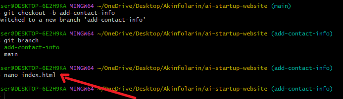

Jerry Add Contact Info To Index.html File
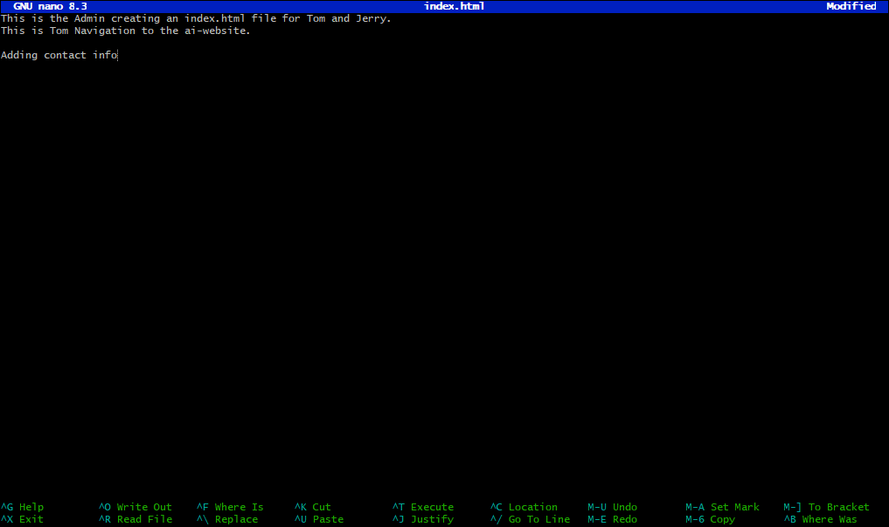

Jerry Staging Changes Made To Index.html
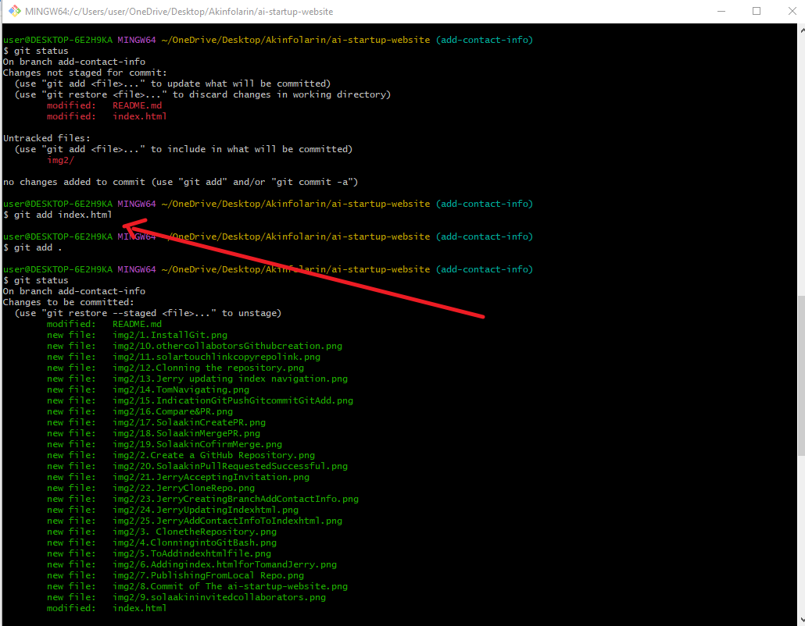

Jerry Commit & Uploads Branch To GitHub Repo For Review And Merging
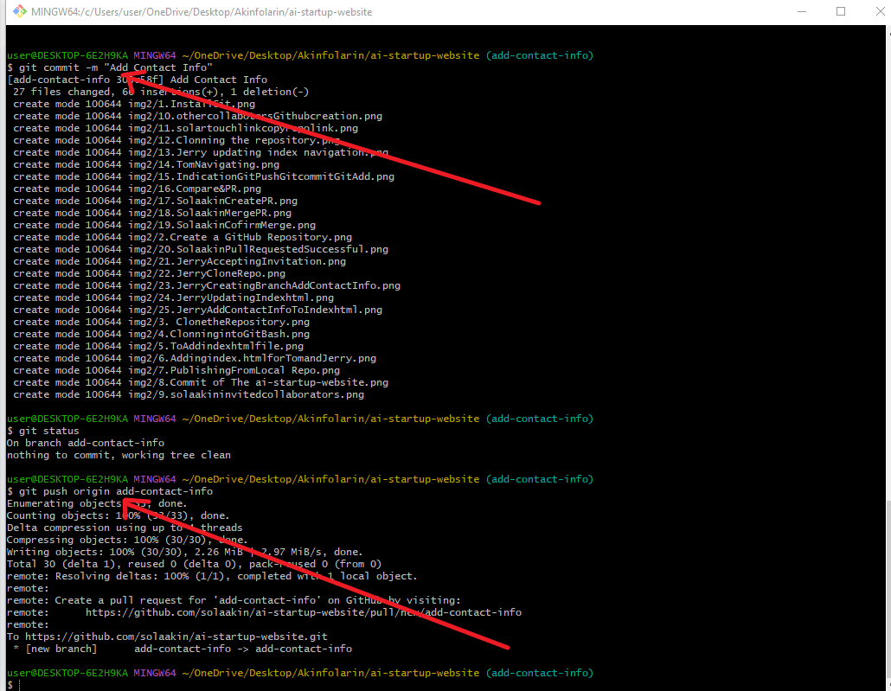